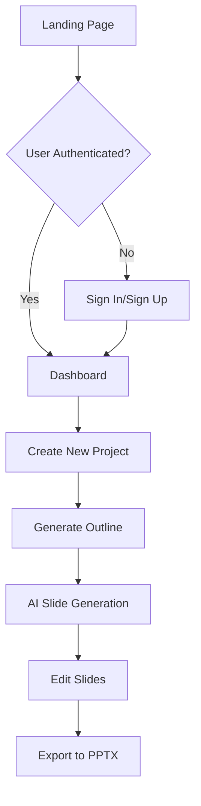

# 🎨 SlideCraft - AI-Powered PPT Generator

> Transform your ideas into stunning presentations effortlessly with AI-powered slide generation

[](https://slide-craft-ai-ppt-generator.vercel.app/)
[](https://reactjs.org/)
[](https://tailwindcss.com/)

## 🚀 Live Demo

**🌐 [https://slide-craft-ai-ppt-generator.vercel.app/](https://slide-craft-ai-ppt-generator.vercel.app/)**

---

## 📋 Table of Contents

- [Overview](#overview)
- [Features](#features)
- [Tech Stack](#tech-stack)
- [Getting Started](#getting-started)
- [Project Structure](#project-structure)
- [Application Flow](#application-flow)
- [Key Components](#key-components)
- [AI Integration](#ai-integration)
- [Authentication](#authentication)
- [Database](#database)
- [Deployment](#deployment)
- [Contributing](#contributing)


---

## 🎯 Overview

SlideCraft is a modern web application that leverages AI to automatically generate professional PowerPoint presentations. Users can simply provide a topic or outline, and the AI will create beautiful, well-structured slides with appropriate content, images, and styling.

### ✨ Key Highlights
- **AI-Powered:** Uses Google Gemini AI for intelligent slide generation
- **Real-time Editing:** In-place editing of slide elements
- **Modern UI:** Built with TailwindCSS and shadcn/ui components
- **Export Ready:** Generate and download PPTX files
- **Responsive:** Works seamlessly on all devices
- **Secure:** User authentication with Clerk

---

## 🌟 Features

### 🎨 **AI Slide Generation**
- Generate complete presentations from simple prompts
- Intelligent content creation with proper structure
- Dynamic image generation and integration
- Customizable themes and color schemes

### ✏️ **Real-time Editing**
- Click-to-edit any slide element
- AI-powered content regeneration
- Live preview of changes
- Inline editing with floating action tools

### 📊 **Professional Output**
- Export to PowerPoint (.pptx) format
- High-quality slide rendering
- Consistent formatting and styling
- 16:9 aspect ratio optimization

### 🎭 **Modern Interface**
- Beautiful gradient backgrounds
- Smooth animations and transitions
- Responsive design for all devices
- Dark/Light theme support

### 🔐 **User Management**
- Secure authentication with Clerk
- Personal project dashboard
- Save and manage multiple presentations
- Cloud storage integration

---

## 🛠 Tech Stack

### **Frontend**
- **React 19.1.1** - UI Library
- **Vite** - Build tool and dev server
- **TailwindCSS 4.1.16** - Utility-first CSS framework
- **React Router DOM** - Client-side routing

### **UI Components**
- **shadcn/ui** - Modern component library
- **Radix UI** - Accessible component primitives
- **Flowbite** - Additional UI components
- **Lucide React** - Icon library

### **Authentication**
- **Clerk** - Complete authentication solution

### **Database**
- **Firebase Firestore** - NoSQL cloud database
- **Real-time data synchronization**

### **AI Integration**
- **Google Gemini AI** - Slide content generation
- **Streaming responses** - Real-time content updates

### **Image Handling**
- **ImageKit** - Dynamic image generation and optimization

### **Export Functionality**
- **pptxgenjs** - PowerPoint file generation
- **html-to-image** - Slide screenshot capture

### **Additional Libraries**
- **Motion** - Animations and transitions
- **React Hook Form** - Form management
- **Zod** - Schema validation
- **Date-fns** - Date manipulation
- **UUID** - Unique identifier generation

---

## 🏁 Getting Started

### Prerequisites
- Node.js 18+ 
- npm or yarn
- Firebase account
- Clerk account
- ImageKit account (optional)

### Installation

1. **Clone the repository**
   ```bash
   git clone https://github.com/ironhulk5226/SlideCraft-AI-PPT-Generator.git
   cd SlideCraft-AI-PPT-Generator
   ```

2. **Install dependencies**
   ```bash
   npm install
   ```

3. **Set up environment variables**
   
   Create a `.env.local` file in the root directory:
   ```env
   # Clerk Authentication
   VITE_CLERK_PUBLISHABLE_KEY=your_clerk_publishable_key
   
   # Firebase Configuration
   VITE_FIREBASE_API_KEY=your_firebase_api_key
   VITE_FIREBASE_AUTH_DOMAIN=your_project.firebaseapp.com
   VITE_FIREBASE_PROJECT_ID=your_project_id
   VITE_FIREBASE_STORAGE_BUCKET=your_project.appspot.com
   VITE_FIREBASE_MESSAGING_SENDER_ID=your_sender_id
   VITE_FIREBASE_APP_ID=your_app_id
   
   # Gemini AI
   VITE_GEMINI_API_KEY=your_gemini_api_key
   ```

4. **Start the development server**
   ```bash
   npm run dev
   ```

5. **Open your browser**
   ```
   http://localhost:5173
   ```

---

## 📁 Project Structure

```
SlideCraft/
├── public/                     # Static assets
├── src/
│   ├── components/
│   │   ├── custom/            # Custom components
│   │   │   ├── Dashboard.jsx   # Main dashboard
│   │   │   ├── Editor.jsx      # Slide editor
│   │   │   ├── Hero.jsx        # Landing page
│   │   │   ├── Header.jsx      # Navigation
│   │   │   ├── Projects.jsx    # Project management
│   │   │   ├── Outline.jsx     # Presentation outline
│   │   │   ├── SlidesFrame.jsx # Individual slide renderer
│   │   │   └── ...
│   │   └── ui/               # Reusable UI components
│   │       ├── button.jsx
│   │       ├── dialog.jsx
│   │       └── ...
│   ├── config/
│   │   └── FirebaseConfig.js  # Firebase configuration
│   ├── context/
│   │   └── UserDetailContext.jsx # User context
│   ├── hooks/                # Custom React hooks
│   ├── lib/
│   │   └── utils.js          # Utility functions
│   ├── assets/               # Images and static files
│   ├── App.jsx              # Main app component
│   ├── main.jsx             # Entry point
│   └── index.css            # Global styles
├── components.json          # shadcn/ui configuration
├── tailwind.config.js       # TailwindCSS configuration
├── vite.config.js          # Vite configuration
└── package.json            # Dependencies and scripts
```

---

## 🔄 Application Flow

### **1. User Journey**


### **2. Slide Generation Process**

1. **Project Creation**
   - User provides presentation topic/prompt
   - System creates project in Firebase
   - Generates unique project ID

2. **Outline Generation**
   - AI analyzes the prompt
   - Creates structured outline with sections
   - Saves outline to database

3. **Slide Generation**
   - AI generates HTML/CSS for each slide
   - Incorporates Tailwind styling and Flowbite components
   - Adds appropriate images via ImageKit
   - Streams content in real-time

4. **Real-time Editing**
   - Users can click any slide element
   - AI regenerates content based on user prompts
   - Changes are saved automatically

5. **Export**
   - Converts slides to images
   - Generates PPTX file using pptxgenjs
   - Downloads to user's device

### **3. Data Flow**

```
Frontend (React) 
    ↓
Authentication (Clerk)
    ↓
Database (Firebase Firestore)
    ↓
AI Processing (Gemini)
    ↓
Image Generation (ImageKit)
    ↓
Export (pptxgenjs)
```

---

## 🧩 Key Components

### **Editor.jsx**
The main slide editor component that handles:
- Slide generation orchestration
- Real-time streaming from AI
- State management for slides
- Export functionality

```jsx
// Key features:
- GeminiSlideCall() - Handles AI streaming
- GenerateSlides() - Orchestrates slide creation
- ExportToPPT() - Converts slides to PowerPoint
```

### **SlidesFrame.jsx**
Individual slide renderer with editing capabilities:
- Renders slides in isolated iframes
- Handles click-to-edit functionality
- Integrates with AI for content regeneration
- Manages slide styling and themes

```jsx
// Key features:
- Dynamic HTML template injection
- Real-time editing with DOM manipulation
- AI-powered content updates
- CORS-safe image handling
```

### **Dashboard.jsx & Projects.jsx**
Project management interface:
- Displays user's presentations
- Handles project creation and deletion
- Navigates between outline and editor views

### **Hero.jsx**
Landing page with:
- Gradient background effects
- Authentication integration
- Video demonstration
- Call-to-action buttons

---

## 🤖 AI Integration

### **Gemini AI Implementation**

The app uses Google Gemini AI for content generation:

```javascript
// Streaming AI response
const GeminiSlideCall = async (prompt, index) => {
  const session = await GeminiAiLiveModel.connect();
  await session.send(prompt);
  
  for await (const message of session.receive()) {
    // Process streaming response
    // Update slide content in real-time
  }
};
```

### **Prompt Engineering**

The AI prompts are carefully structured to generate:
- Professional slide content
- Appropriate HTML structure
- TailwindCSS styling
- Flowbite component integration
- Dynamic image URLs

### **Real-time Streaming**

The app displays AI-generated content as it's being created:
- Word-by-word text generation
- Live preview updates
- Progressive slide building

---

## 🔐 Authentication

### **Clerk Integration**

User authentication is handled by Clerk:

```jsx
import { useUser, SignInButton } from '@clerk/clerk-react';

const { user } = useUser();
// Conditional rendering based on auth state
{!user ? <SignInButton /> : <DashboardButton />}
```

### **Protected Routes**
- Dashboard access requires authentication
- Project data is user-specific
- Secure API calls to Firebase

---

## 🗄 Database

### **Firebase Firestore Schema**

```
projects/
  {projectId}/
    - userInputPrompt: string
    - slideCount: number
    - designStyle: object
    - outline: array
    - slides: array
    - createdAt: timestamp
    - userId: string
```

### **Data Operations**
- Real-time synchronization
- Automatic saves during editing
- Optimistic updates for better UX

---

## 🎨 Styling & Theming

### **TailwindCSS Configuration**

Dynamic theme injection for slides:

```javascript
// Color themes are injected into slide templates
const colors = {
  primary: "#6366F1",
  secondary: "#10B981",
  accent: "#F59E42"
};

// JSON.stringify for safe HTML injection
.replace("{colorCodes}", JSON.stringify(colors))
```

### **Component Styling**
- shadcn/ui for consistent components
- Custom gradients and animations
- Responsive design principles

---

## 📦 Export Functionality

### **PowerPoint Generation**

```javascript
const ExportToPPT = async () => {
  const pptx = new PptxGenJS();
  
  // Convert slides to images
  const images = await Promise.all(slideConversions);
  
  // Add slides to presentation
  images.forEach(image => {
    const slide = pptx.addSlide();
    slide.addImage({
      data: image,
      x: 0, y: 0,
      w: 10, h: 5.625 // 16:9 aspect ratio
    });
  });
  
  await pptx.writeFile({ fileName: 'presentation.pptx' });
};
```

---

## 🚀 Deployment

### **Vercel Deployment**

The app is deployed on Vercel with:
- Automatic builds from GitHub
- Environment variable configuration
- CDN distribution
- Zero-downtime deployments

### **Build Configuration**

```json
{
  "scripts": {
    "dev": "vite",
    "build": "vite build",
    "preview": "vite preview"
  }
}
```

---

## 📈 Performance Optimizations

### **Code Splitting**
- Lazy loading of routes
- Dynamic imports for heavy components

### **Image Optimization**
- ImageKit for automatic optimization
- Responsive image loading
- CORS-safe image handling

### **Caching**
- Firebase caching for frequently accessed data
- Browser caching for static assets

---

## 🧪 Development Scripts

```bash
# Start development server
npm run dev

# Build for production
npm run build

# Preview production build
npm run preview

# Lint code
npm run lint
```

---

## 🤝 Contributing

1. Fork the repository
2. Create a feature branch (`git checkout -b feature/amazing-feature`)
3. Commit your changes (`git commit -m 'Add amazing feature'`)
4. Push to the branch (`git push origin feature/amazing-feature`)
5. Open a Pull Request

---


## 📞 Contact

**Developer:** [ironhulk5226](https://github.com/ironhulk5226)

**Project Link:** [https://github.com/ironhulk5226/SlideCraft-AI-PPT-Generator](https://github.com/ironhulk5226/SlideCraft-AI-PPT-Generator)

**Live Demo:** [https://slide-craft-ai-ppt-generator.vercel.app/](https://slide-craft-ai-ppt-generator.vercel.app/)

---

<div align="center">
  <p>Made with ❤️ using React, TailwindCSS, and AI</p>
  <p>⭐ Star this repo if you found it useful!</p>
</div>
